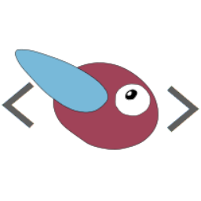
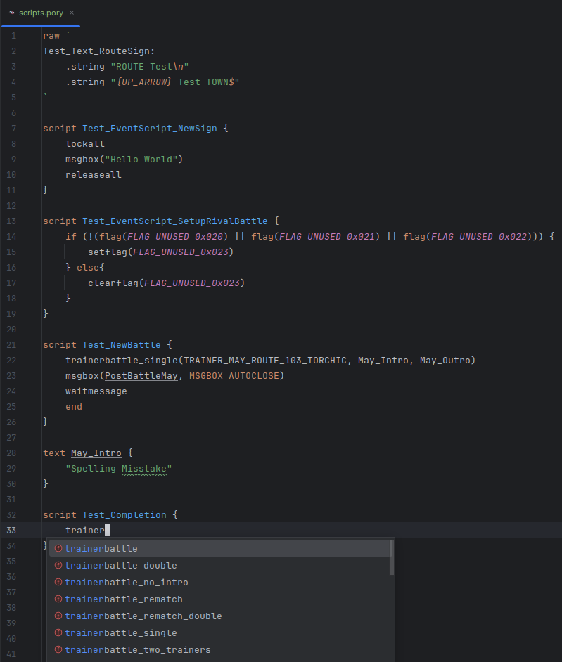
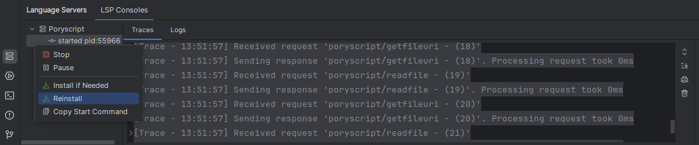
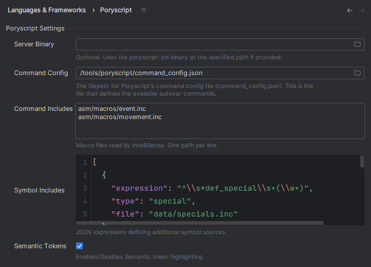

<!--suppress HtmlDeprecatedAttribute -->
<h1 align="center" style="font-weight: normal;"><b>Poryscript-IDEA</b></h1>

Poryscript plugin for Jetbrains IDEs.

<!-- Plugin description -->
This plugin adds [Poryscript](https://github.com/huderlem/poryscript) support to Jetbrains IDEs
like IntelliJ or CLion.
It provides syntax highlighting via a TextMate bundle and runs the
[Poryscript language server](https://github.com/huderlem/poryscript-pls)
with the [LSP4IJ](https://github.com/redhat-developer/lsp4ij) plugin.
<!-- Plugin description end -->
This plugin is essentially a port of SBird1337's
[VS code extension](https://github.com/SBird1337/poryscript-language).

## Configuration

Poryscript-IDEA downloads the poryscript-pls language server binary for your platform
from GitHub and runs it via the LSP4IJ plugin.
You can configure the Language Server using the LSP4IJ tool window at the bottom of your IDE.
Here you can e.g. trace the logs or trigger a reinstall of the language server.

Configuring the Language Server is done on a project level.
The settings for Poryscript-IDEA can be found here: 
<kbd>Settings</kbd> > <kbd>Languages & Frameworks</kbd> > <kbd>Poryscript</kbd>. 
Here you can e.g. set a custom server binary or the command and symbol includes.

## Installation

- Using the IDE built-in plugin system:

  <kbd>Settings</kbd> > <kbd>Plugins</kbd> > <kbd>Marketplace</kbd> > <kbd>Search for "
  Poryscript-IDEA"</kbd> >
  <kbd>Install</kbd>

- Using JetBrains Marketplace:

  Go to [JetBrains Marketplace](https://plugins.jetbrains.com/plugin/28746-poryscript) and install it by clicking
  the <kbd>Install to ...</kbd> button in case your IDE is running.

  You can also download the [latest release](https://plugins.jetbrains.com/plugin/28746-poryscript/versions) from
  JetBrains Marketplace and install it manually using  
  <kbd>Settings</kbd> > <kbd>Plugins</kbd> > <kbd>⚙️</kbd> > <kbd>Install plugin from disk...</kbd>

- Manually:

  Download the [latest release](https://github.com/okafke/poryscript-idea/releases/latest) and install it manually using  
  <kbd>Settings</kbd> > <kbd>Plugins</kbd> > <kbd>⚙️</kbd> > <kbd>Install plugin from disk...</kbd>

---
Plugin based on the [IntelliJ Platform Plugin Template][template].

[template]: https://github.com/JetBrains/intellij-platform-plugin-template

[docs:plugin-description]: https://plugins.jetbrains.com/docs/intellij/plugin-user-experience.html#plugin-description-and-presentation
